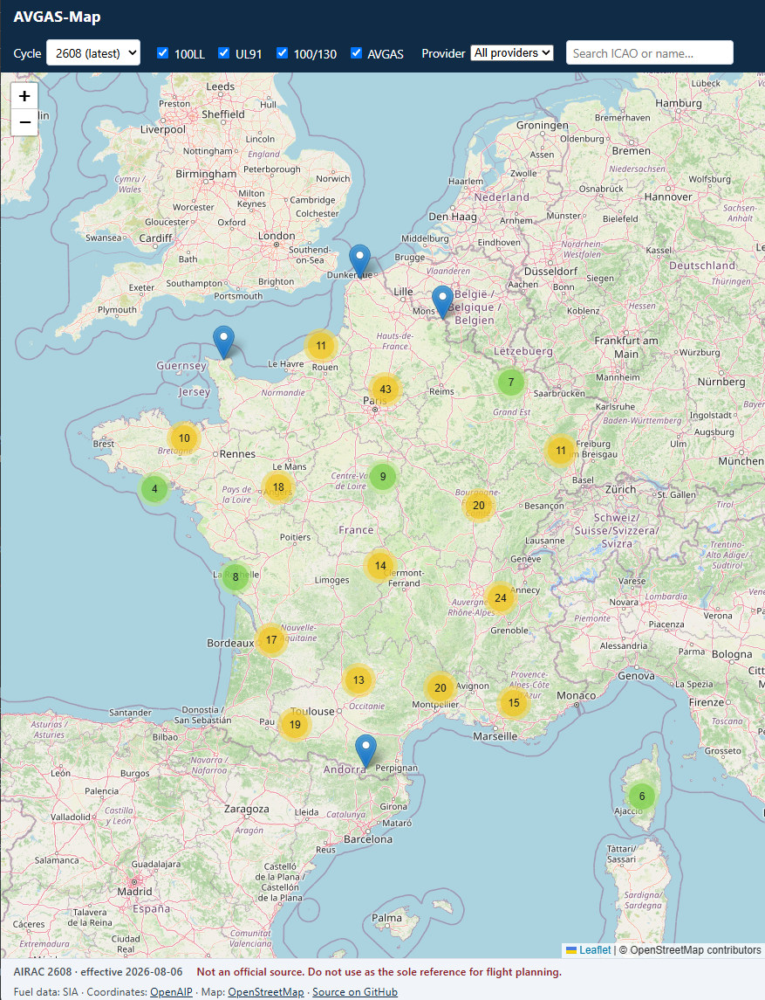
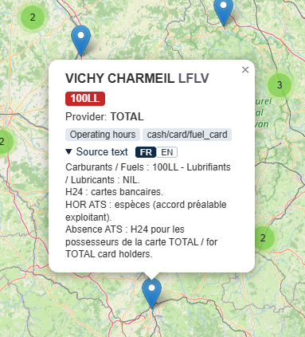

# AVGAS-Map

<p align="center">
  <a href="https://github.com/diaznet/avgas-map/actions/workflows/pipeline.yml"></a>
  
  
  
  <a href="LICENSE"></a>
</p>

A free, statically-hosted map of aerodromes offering **AVGAS**, for pilots
planning fuel stops. Scope is the EASA area, using aerodrome charts available
through the autorouter WebDAV. France is the first country implemented.

<h3 align="center">
  🗺️ <a href="https://diaznet.github.io/avgas-map/">View the live map →</a>
</h3>

<p align="center">
  
</p>

<p align="center"><em>Click any aerodrome to see its fuel details:</em></p>

<p align="center">
  
</p>

> ⚠️ **Not an official source.** This map must **not** be used as the sole
> reference for flight planning. Always consult the official AIP and current
> NOTAMs. Data may be incomplete, stale, or wrong.

Fuel data is derived from the official SIA VAC charts (France); aerodrome
coordinates come from [OpenAIP](https://www.openaip.net/). Base map ©
[OpenStreetMap](https://www.openstreetmap.org/copyright) contributors.

## How it works

- A **Python pipeline** (`pipeline/`) retrieves aerodrome charts from the
  autorouter WebDAV, parses each country's fuel information (France: the
  `10 - AVT` field of each VAC), joins coordinates from OpenAIP by ICAO code,
  and assembles a normalized GeoJSON dataset of AVGAS aerodromes.
- The pipeline runs in GitHub Actions on **AIRAC effective dates**, publishes
  each cycle's dataset as a **GitHub Release** asset, and deploys the static
  site to **GitHub Pages**. It commits nothing to the repository.
- A **static front-end** (`web/`, plain HTML/JS + Leaflet) loads a manifest,
  lets you pick an AIRAC cycle (defaulting to the latest), and renders AVGAS
  aerodromes with fuel detail. Only aerodromes offering an AVGAS grade are
  shown; Jet A-1 is a secondary detail and never places a marker on its own.

See [`.kiro/specs/avgas-map/`](.kiro/specs/avgas-map/) for the full spec,
[`CONTEXT.md`](CONTEXT.md) for domain vocabulary, and
[`docs/adr/`](docs/adr/) for key decisions.

## Run locally

You can generate a dataset and preview the whole map on your machine, with no
publishing. Requires Python 3.12+.

### 1. Install the pipeline

```bash
cd pipeline
python -m venv .venv
# Windows:      .venv\Scripts\activate
# macOS/Linux:  source .venv/bin/activate
pip install -r requirements.txt
```

### 2. Generate a dataset into `web/data/`

**Offline (no credentials)** — builds from bundled fixtures, great for a quick
look at the UI:

```bash
python run_pipeline.py --dry-run --local --cycle 2609
```

**Real France data** — fetches live VAC charts (needs autorouter credentials).
Copy `pipeline/.env.example` to a `.env` at the repository root and fill in your
`AUTOROUTER_USER` / `AUTOROUTER_PASS` (the `.env` is gitignored and never
committed; OpenAIP needs no credentials), then:

```bash
python run_pipeline.py --local
```

Either command writes `web/data/index.json` and `web/data/dataset-<cycle>.geojson`.

### 3. Serve the site

The front-end must be served over HTTP (`file://` breaks `fetch`):

```bash
cd ../web
python -m http.server 8000
```

Open <http://localhost:8000>. The front-end tries the local `data/index.json`
first, so it renders your locally-generated dataset.

## Repository layout

```
pipeline/   Python data pipeline (parsers, retrieval, join, guard, publish)
web/        static front-end (Leaflet map); web/data/ is local-only, gitignored
.github/    GitHub Actions workflow (AIRAC-gated build + publish + deploy)
docs/adr/   architecture decision records
CONTEXT.md  domain glossary
```

For pipeline internals (credentials, AIRAC dates, tests, guard thresholds,
OpenAIP config) see [`pipeline/README.md`](pipeline/README.md).

## Deployment (maintainer, one-time)

The workflow runs without maintenance once these are set on the GitHub repo:

1. Add repository **secrets** `AUTOROUTER_USER` and `AUTOROUTER_PASS`.
2. Enable **GitHub Pages** with source = **GitHub Actions**.
3. Ensure the workflow has `contents: write`, `pages: write`, `id-token: write`
   (already declared in the workflow file).

Then the pipeline self-triggers on AIRAC dates, or run it manually via the
Actions tab ("Run workflow"), optionally forcing a cycle.

## License

This project is licensed under the [MIT License](LICENSE).

Bundled/consumed third-party components keep their own terms: the map uses
[Leaflet](https://leafletjs.com/) (BSD-2-Clause, vendored under `web/vendor/`),
aerodrome coordinates from [OpenAIP](https://www.openaip.net/) (attribution
required), base map tiles © [OpenStreetMap](https://www.openstreetmap.org/copyright)
contributors, and fuel data derived from the French SIA eAIP.
